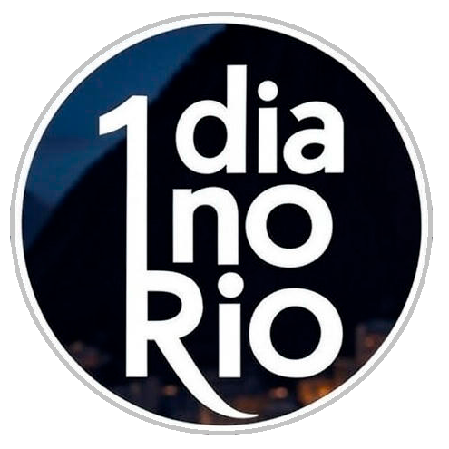

<div align="center">
  
</div>

# Multi-Objective Tour Planning - Rio de Janeiro

Sistema de otimização multiobjetivo para planejamento de rotas turísticas no Rio de Janeiro utilizando o algoritmo NSGA-II.

## Sobre o Projeto

Este projeto implementa um sistema de otimização multiobjetivo para gerar roteiros turísticos de um dia no Rio de Janeiro. O sistema utiliza o algoritmo NSGA-II para encontrar soluções que balanceiam quatro objetivos simultaneamente:

1. Minimização de custos de transporte e entrada em atrações
2. Minimização de tempo de deslocamento
3. Maximização de atrações visitadas
4. Maximização de bairros visitados

## 1. Aplicativo Web

O aplicativo é desenvolvido em **Flask/Dash** com visualizações **D3.js** e **Plotly**, oferecendo interface responsiva para exploração interativa das soluções do Pareto.

### Instalação e Execução
```bash
cd app
pip install -r requirements.txt
python app.py
```

Acesse em: **http://localhost:8051**

**Mobile/Tablet**: Acesse o mesmo endereço no navegador do dispositivo conectado à mesma rede local.

### Funcionalidades
- Visualização de coordenadas paralelas das soluções não-dominadas
- Harmony visualization multi-objetivo com D3.js
- Navegação responsiva entre soluções
- Detalhes completos de cada roteiro (custos, tempos, atrações)

## 2. Algoritmo NSGA-II

### Pré-requisitos
- C++17+ e CMake 3.15+

### Compilação
```bash
mkdir build && cd build
cmake ..
cmake --build .
./bin/tourist_route
```

### Métricas
```bash
cd metrics
python calculate_hypervolume.py
python calculate_binary_coverage.py
```

## Estrutura do Projeto
```
├── src/           # Código-fonte C++ do NSGA-II
├── include/       # Headers
├── data/          # Dados das atrações
├── results/       # Resultados experimentais
├── app/           # Aplicativo Flask/Dash
```

## Autores

| Nome | Email | Instituição |
|------|-------|-------------|
| Augusto Magalhães Pinto de Mendonça | augustompm@id.uff.br | Universidade Federal Fluminense |
| Filipe Pessoa Sousa | filipe.sousa@pos.ime.uerj.br | Universidade do Estado do Rio de Janeiro |
| Igor Machado Coelho | imcoelho@ic.uff.br | Universidade Federal Fluminense |

## Licença

Este projeto está licenciado sob a **Creative Commons Atribuição-NãoComercial (CC BY-NC)**.

**Resumo**: Permitido usar, estudar e modificar para fins acadêmicos e não-comerciais. Obrigatório dar crédito aos autores. Proibido uso comercial sem autorização.

Detalhes: [https://creativecommons.org/licenses/by-nc/4.0/](https://creativecommons.org/licenses/by-nc/4.0/)